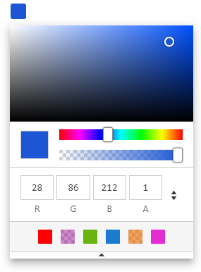
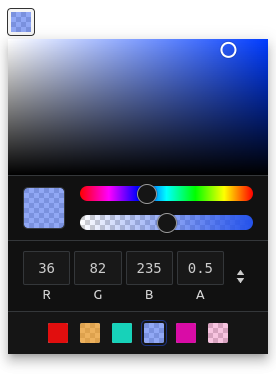

# Alwan

&nbsp;&nbsp;&nbsp;

<div align="center">  
  
  &nbsp;&nbsp;&nbsp;&nbsp;&nbsp;

  
  &nbsp;&nbsp;&nbsp;&nbsp;&nbsp;
</div>

&nbsp;&nbsp;&nbsp;

<div>
  
  
</div>


A simple, lightweight, customizable, touch friendly color picker, written in vanilla javascript with zero dependencies.

## features
- Touch friendly.
- Support dark theme.
- Alpha channel (opacity).
- Support 3 color formats hsl, rgb and hex.
- Keyboard accessible.
- Simple easy to use interface (inspired by google chrome's color picker).
- No dependencies.
- Copy color to the clipboard.
- Lightweight.

## Demo
[Click here to try it](https://sofianchouaib.github.io/alwan/)
## Getting started
Install using package manager:
```shell
npm install alwan
```
or

```
yarn add alwan
```

Import files
```javascript
// Import javascript.
import alwan from 'alwan';
// Import css.
import 'alwan/dist/css/alwan.min.css';
```
### CDN
Add it to your page.
- Jsdelivr CDN
```html
<!-- Style -->
<link rel="stylesheet" href="https://cdn.jsdelivr.net/npm/alwan/dist/css/alwan.min.css">

<!-- Script -->
<script src="https://cdn.jsdelivr.net/npm/alwan/dist/js/alwan.min.js"></script>
```
- Unpkg CDN
```html
<!-- Style -->
<link rel="stylesheet" href="https://unpkg.com/alwan/dist/css/alwan.min.css">

<!-- Script -->
<script src="https://unpkg.com/alwan/dist/js/alwan.min.js"></script>
```

## Usage
Alwan can take two arguments,
a reference element either a selector or an HTML element (required),
and options object (optional).
```javascript

const alwan = new Alwan('#reference', {
  // Options...
});
```
## Options
*You can try these options in the [demo](https://sofianchouaib.github.io/alwan/), play around with it*


- `id` (default `''`) — Set the container's (widget) id.
- `classname` (default `''`) — One or many classes (separated by a white space) to add to the preset button.
- `theme` (default `light`) — Choose a theme, 'dark' or 'light'.
- `toggle` (default `true`) — Toggle picker's visibility (Show/Hide), Setting this to false keeps the picker visible.
- `popover` (default `true`) — Display picker as a popover, otherwise display it as a block (embeded in the page content).
- `position` (default `bottom-start`) — Set the position of the popper relative to the reference element. The position has two values seperated by a dash (-). The first value is the direction (top, bottom, right, left) and the second value is the alignment (start, center, end), omitting this value will default to center.

    *Note: If the picker container has no space to be placed, it will auto-position itself based on the available space.*
- `margin` (default `8`) — The gap (in pixels) between the picker container and the reference element.
- `preset` (default `true`) — Replace the reference element with a pre-styled button.
- `color` (default `#000`) — Initial color.
- `default` (default `#000`) — Default color.
- `target` (default `''`) — Target can be a selector or an HTML element, If the option popover is set to true, the picker container will be positionned retalive to this element else if popover option is set to false, the picker container will be appended as a child into this element.
- `disabled` (default `false`) — Disable the picker, users won't be able to pick colors.
- `format` (default `rgb`) — Initial color format.
- `singleInput` (default `false`) — For the formats 'hsl' and 'rgb', choose a single input to display the color string, if false, display an input for each color channel.
- `inputs` (default `{ hex: true, rgb: true,  hsl: true  }`) — Choose color formats for the picker input.
- `opacity` (default `true`) — Support alpha channel and display opacity slider.
- `preview` (default `true`) — Preview the color.
- `copy` (default `true`) — Add/Remove a copy button.
- `swatches` (default `[]`) — Array of colors, invalid colors will default to rgb(0,0,0).
- `toggleSwatches` (default `false`) — Show/Hide swatches container (Make swatches container collapsible).
- `shared` (default `false`) — Picker widget shared between multiple instance (this is good if you have many color picker instances).

**Note:** In the reference element you can access the css custom property `--lw-color` to get color value.

## Events
Use the method `on`, that has two parameters, `event` and `handler` (callback function).
```javascript
alwan.on('event', ev => {
  // ...
});
```
| Event  | Argument | Description                    |
|------- | --------------- | ------------------------------ |
| `open` | `event`   | Fires when the picker get opened |
| `close` | `event`  | Fires when the picker get closed |
| `change` | `event` | Fires when an alternation to the color is committed by the user, similar to the DOM `change` event  |
| `color` | `event` | Similar to the `input` event, fires every time the color changes |

### Event object
- `type` — Event type.
- `source` — Event source. 
- **hsv**() : `object` — Gets an HSV color object.
- **rgb**(asArray: `boolean`) : `object` — Get an RGB color object or an Array if `asArray` is set to true,
call the method `toString()` on this object to get an RGB string.
- **hsl**(asArray: `boolean`) : `object` — Get an HSL color object or an Array if `asArray` is set to true,
call the method `toString()` on this object to get an HSL string.

- **hex**() `string` — Gets a hex color.

```javascript
// e.g.
alwan.on('change', (ev) => {
  ev.type                 // change
  ev.source               // Element

  // RGB color.
  ev.rgb()                // output: { r: 0, g: 0, b: 0, a: 1}
  ev.rgb(true)            // output: [0, 0, 0, 0]
  ev.rgb().toString()     // output: rgba(0, 0, 0, 1)
  
  // Hex color.
  ev.hex()                // output: #000000
  
  // HSL color.
  ev.hsl()               // output: { h: 0, s: 0, l: 0, a: 1 }
  ev.hsl(true)           // output: [0, 0, 0, 0]
  ev.hsl().toString()    // output: hsla(0, 0%, 0%, 1)
})
```

# Methods
- **setColor**(color: `string | object`) : `object` — Sets a color from a string or a color object, this method doesn't trigger `change` or `color` events.
If you want to trigger events add `.trigger(change | color)` to it
```javascript
// Set color 'purple' and trigger 'change' event.
picker.setColor('purple').trigger('change');
```
- **getColor**() : `object` — Returns the color object.
- **open**() — Open/Show picker.
- **isOpen**() : `boolean` — Returns the state of the picker opened `true` or closed `false`.
- **toggle**() — Toggle picker, if its hidden show it else hide it.
- **setOptions**(options: `object`) — Sets one or more options for the picker.
- **trigger**(event: `string`) — Triggers an event.
- **on**(event: `string`, handler: `callback`) — Attaches an event handler function.
- **off**(event: `string`, handler: `callback`) — Removes an event handler, if the handler argument is omitted then all handlers attach to this event will be removed, calling this method without arguments will remove all handlers of all events.
- **disable**() — Disables picker (users won't be able to pick a color).
- **enable**() — Enables picker.
- **reposition**() — Updates picker position only if it's a popover.
- **addSwatch**(color: `string`) — Adds a swatch button.
- **removeSwatch**(swatch: `string | number`) — Removes color from the `Options.swatches` array, also removes its button from the swatches container.
  
  *Note:* swatch argument can be a color string in the `Options.swatches` array or an index.
- **reset**() — Reset to default color.
- **destroy**() — Removes the color picker functionality completely(free up memory).
